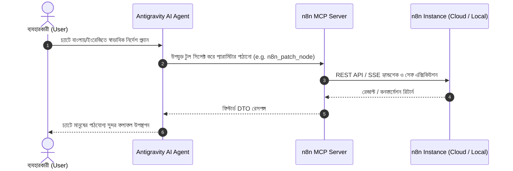

# 📘 n8n MCP Server: Complete User & Prompting Guide (ব্যবহারবিধি ও প্রম্পট গাইড)

> **স্বাগতম!** এই গাইডটিতে বিস্তারিতভাবে ব্যাখ্যা করা হয়েছে কীভাবে আপনি চ্যাটে স্বাভাবিক ভাষায় প্রম্পট দিয়ে আপনার **n8n Automation Engine**-কে ১০০% স্বয়ংক্রিয়ভাবে নিয়ন্ত্রণ করবেন। কোনো জটিল কোড বা টার্মিনাল কমান্ড ছাড়াই AI এজেন্টকে দিয়ে প্রফেশনাল লেভেলের অটোমেশন তৈরি ও মেইনটেইন করার নিয়মাবলী নিচে দেওয়া হলো।

---

## 📑 সূচিপত্র (Table of Contents)
1. [মৌলিক ধারণা ও কাজের ধরন (Core Architecture)](#1-মৌলিক-ধারণা-ও-কাজের-ধরন)
2. [AI এজেন্টকে প্রম্পট দেওয়ার মূল নিয়মাবলী (Golden Rules of Prompting)](#2-ai-এজেন্টকে-প্রম্পট-দেওয়ার-মূল-নিয়মাবলী)
3. [১০টি বাস্তব ব্যবহারের প্রম্পট রেসিপি (10 Real-World Copy-Paste Prompts)](#3-১০টি-বাস্তব-ব্যবহারের-প্রম্পট-রেসিপি)
   - [রেসিপি ১: নতুন ওয়ার্কফ্লো তৈরি (Create Workflow from Scratch)](#রেসিপি-১-নতুন-ওয়ার্কফ্লো-তৈরি)
   - [রেসিপি ২: নির্দিষ্ট নোডের ডিফ-প্যাচ ও টোকেন সেভিং (Diff-Patching)](#রেসিপি-২-নির্দিষ্ট-নোডের-ডিফ-প্যাচ-ও-টোকেন-সেভিং)
   - [রেসিপি ৩: কোনো ভুল হলে ১-ক্লিকে স্ন্যাপশট রোলব্যাক (Snapshot Rollback)](#রেসিপি-৩-কোনো-ভুল-হলে-১-ক্লিকে-স্ন্যাপশট-রোলব্যাক)
   - [রেসিপি ৪: সেফ স্যান্ডবক্স টেস্টিং ও পিন-ডাটা (Safe Testing with Pin Data)](#রেসিপি-৪-সেফ-স্যান্ডবক্স-টেস্টিং-ও-পিন-ডাটা)
   - [রেসিপি ৫: ব্যর্থ এক্সিকিউশনের রুট কজ অ্যানালাইসিস (RCA & Error Auditing)](#রেসিপি-৫-ব্যর্থ-এক্সিকিউশনের-রুট-কজ-অ্যানালাইসিস)
   - [রেসিপি ৬: সম্পূর্ণ স্বয়ংক্রিয় সেলফ-হিলিং লুপ (Autonomous Self-Healing)](#রেসিপি-৬-সম্পূর্ণ-স্বয়ংক্রিয়-সেলফ-হিলিং-লুপ)
   - [রেসিপি ৭: ল্যাংচেইন ও AI এজেন্ট গ্রাফ ভ্যালিডেশন (LangChain Graph Validator)](#রেসিপি-৭-ল্যাংচেইন-ও-ai-এজেন্ট-গ্রাফ-ভ্যালিডেশন)
   - [রেসিপি ৮: ক্লাউডফ্লেয়ার বাইপাস স্টিলথ স্ক্র্যাপিং (Anti-Bot Stealth Scraping)](#রেসিপি-৮-ক্লাউডফ্লেয়ার-বাইপাস-স্টিলথ-স্ক্র্যাপিং)
   - [রেসিপি ৯: ২,০০০+ ভেরিফায়েড টেমপ্লেট লাইব্রেরি সার্চ (Template Library)](#রেসিপি-৯-২০০০-ভেরিফায়েড-টেমপ্লেট-লাইব্রেরি-সার্চ)
   - [রেসিপি ১০: ওয়ার্কফ্লো চালু/বন্ধ ও প্রোডাকশন হেলথ চেক (Activation & Liveness)](#রেসিপি-১০-ওয়ার্কফ্লো-চালুবন্ধ-ও-প্রোডাকশন-হেলথ-চেক)
4. [কী করবেন এবং কী করবেন না (Dos and Don'ts)](#4-কী-করবেন-এবং-কী-করবেন-না)
5. [সমস্যা হলে করণীয় (Troubleshooting & FAQs)](#5-সমস্যা-হলে-করণীয়)

---

## 1. মৌলিক ধারণা ও কাজের ধরন

### n8n MCP কীভাবে কাজ করে?
আপনি যখন চ্যাটে কোনো নির্দেশ দেন (যেমন: *"আমার ওয়ার্কফ্লোতে স্ল্যাক মেসেজ পাঠানোর নোড যোগ করো"*), তখন AI মডেল নিচের ধাপে কাজটি করে:



### কেন এই সার্ভারটি বিশেষ?
1. **টোকেন অপটিমাইজেশন (85-90% সাশ্রয়)**: পুরো ৫০০ লাইনের ওয়ার্কফ্লো বার বার না পাঠিয়ে শুধু প্রয়োজনীয় নোডটি প্যাচ করে।
2. **অটোমেটিক স্ন্যাপশট**: যেকোনো পরিবর্তনের পূর্বে অটোমেটিক লোকাল ব্যাকআপ রাখা হয়, যাতে কোনো ভুল হলে নিমিষেই রোলব্যাক করা যায়।
3. **এন্টি-হ্যালুসিনেশন ক্যাটালগ**: নোডের সঠিক প্রোপার্টি ও প্যারামিটার আগে থেকেই যাচাই করে নেওয়া হয়।

---

## 2. AI এজেন্টকে প্রম্পট দেওয়ার মূল নিয়মাবলী

এজেন্টকে সবচেয়ে কার্যকরভাবে কাজ করানোর জন্য প্রম্পটে ৩টি উপাদান স্পষ্ট রাখুন:

| উপাদান | বিবরণ | উদাহরণ |
|---|---|---|
| **১. লক্ষ্য (Goal)** | আপনি ঠিক কী তৈরি বা পরিবর্তন করতে চান | *"একটি নতুন লিড নোটিফিকেশন ওয়ার্কফ্লো বানাও"* |
| **২. নোড বা সার্ভিসের নাম** | কোন কোন নোড যুক্ত থাকবে | *"Webhook, OpenAI Chat Model, এবং Telegram"* |
| **৩. লজিক বা ডাটা ফ্লো** | ডাটা কীভাবে প্রসেস হবে | *"Webhook থেকে ইমেইল পেলে OpenAI দিয়ে সামারি করে টেলিগ্রামে পাঠাও"* |

---

## 3. ১০টি বাস্তব ব্যবহারের প্রম্পট রেসিপি

### রেসিপি ১: নতুন ওয়ার্কফ্লো তৈরি
> **কখন ব্যবহার করবেন:** যখন একদম শুরু থেকে কোনো অটোমেশন বানাতে চান।

**চ্যাটে বলার প্রম্পট (Copy-Paste):**
```text
আমার n8n অ্যাকাউন্টে 'Customer Onboarding Pipeline' নামে একটি নতুন ওয়ার্কফ্লো তৈরি করো। 
ফ্লোটি এমন হবে:
1. প্রথমে একটি Webhook ট্রিগার থাকবে (POST মেথড, পাথ: /new-customer)।
2. এরপর একটি Code নোড থাকবে যা ইনকামিং ডাটা থেকে customer_name এবং email ভ্যালিডেট করবে।
3. সবশেষে একটি Slack নোড থাকবে যা #sales চ্যানেলে নতুন কাস্টমারের ওয়েলকাম মেসেজ পাঠাবে।
```

---

### রেসিপি ২: নির্দিষ্ট নোডের ডিফ-প্যাচ ও টোকেন সেভিং
> **কখন ব্যবহার করবেন:** পুরো ওয়ার্কফ্লো রিরাইট না করে শুধু নির্দিষ্ট নোডের প্যারামিটার বা ক্রেডেনশিয়াল বদলাতে।

**চ্যাটে বলার প্রম্পট (Copy-Paste):**
```text
আমার 'Customer Onboarding Pipeline' ওয়ার্কফ্লোর 'Slack Alert' নোডটি প্যাচ করো। 
স্ল্যাকের চ্যানেল পরিবর্তন করে '#incident-response' করে দাও এবং মেসেজ টেক্সট আপডেট করে লিখো:
"New customer registered: {{ $json.customer_name }}"
```

---

### রেসিপি ৩: কোনো ভুল হলে ১-ক্লিকে স্ন্যাপশট রোলব্যাক
> **কখন ব্যবহার করবেন:** যদি কোনো ভুল আপডেটের কারণে ওয়ার্কফ্লো ভেঙে যায়।

**চ্যাটে বলার প্রম্পট (Copy-Paste):**
```text
আমার ওয়ার্কফ্লো আইডি '5azIShFH4vtIaVHK'-তে সর্বশেষ প্যাচে ভুল হয়েছে। 
অনতিবিলম্বে আগের সেভ করা স্ন্যাপশটে রোলব্যাক করো এবং ওয়ার্কফ্লো রিস্টোর করো।
```

---

### রেসিপি ৪: সেফ স্যান্ডবক্স টেস্টিং ও পিন-ডাটা
> **কখন ব্যবহার করবেন:** লাইভ ট্রাফিক বা পেমেন্ট গেটওয়ে ছাড়া ডামি ডাটা দিয়ে নোড টেস্ট করতে।

**চ্যাটে বলার প্রম্পট (Copy-Paste):**
```text
আমার ওয়ার্কফ্লোর 'Stripe Webhook' নোডটিতে টেস্ট করার জন্য পিন-ডাটা (mock pinData) ইনজেক্ট করো:
{
  "event": "charge.succeeded",
  "amount": 4900,
  "currency": "usd",
  "customer_email": "alex@example.com"
}
```

---

### রেসিপি ৫: ব্যর্থ এক্সিকিউশনের রুট কজ অ্যানালাইসিস
> **কখন ব্যবহার করবেন:** যখন কোনো ওয়ার্কফ্লো ফেইল করে এবং কারণ বুঝতে চান।

**চ্যাটে বলার প্রম্পট (Copy-Paste):**
```text
আমার সর্বশেষ ফেইল হওয়া এক্সিকিউশন আইডি '782910' অডিট করো। 
কোন নোডে ক্র্যাশ হয়েছে, এরর কোড কী এবং রুট কজ কী—বিস্তারিত জানাও।
```

---

### রেসিপি ৬: সম্পূর্ণ স্বয়ংক্রিয় সেলফ-হিলিং লুপ
> **কখন ব্যবহার করবেন:** এক্সিকিউশন ক্র্যাশ নিজে থেকেই সারিয়ে স্বয়ংক্রিয়ভাবে রি-রান করতে।

**চ্যাটে বলার প্রম্পট (Copy-Paste):**
```text
এক্সিকিউশন '782910' তে HTTP 401 অথেন্টিকেশন এরর এসেছে। 
নোডটিতে সঠিক হেডার যোগ করে দাও এবং ওয়ার্কফ্লোটি অটো-হিল করে রি-রান করো।
```

---

### রেসিপি ৭: ল্যাংচেইন ও AI এজেন্ট গ্রাফ ভ্যালিডেশন
> **কখন ব্যবহার করবেন:** LangChain বা AI Agent নোড বসানোর পর তার পোর্ট কানেকশন ঠিক আছে কি না নিশ্চিত হতে।

**চ্যাটে বলার প্রম্পট (Copy-Paste):**
```text
আমার 'AI Support Agent' ওয়ার্কফ্লোটির ল্যাংচেইন ড্যাগ গ্রাফ ভ্যালিডেট করো। 
OpenAI মডেলটি সঠিক ai_languageModel পোর্টে এবং ক্যালকুলেটর টুলটি ai_tool পোর্টে ঠিকমতো কানেক্টেড আছে কি না চেক করো।
```

---

### রেসিপি ৮: ক্লাউডফ্লেয়ার বাইপাস স্টিলথ স্ক্র্যাপিং
> **কখন ব্যবহার করবেন:** Reddit, LinkedIn বা ক্লাউডফ্লেয়ার প্রটেক্টেড সাইট থেকে ব্লক না খেয়ে ডাটা স্ক্র্যাপ করতে।

**চ্যাটে বলার প্রম্পট (Copy-Paste):**
```text
আমার n8n ওয়ার্কফ্লোর জন্য একটি behavioral-playwright স্টিলথ স্ক্র্যাপার নোড তৈরি করো।
টার্গেট URL হবে: 'https://reddit.com/r/programming/new' 
এবং ওয়েট করার CSS সিলেক্টর হবে: 'shreddit-post'।
```

---

### রেসিপি ৯: ২,০০০+ ভেরিফায়েড টেমপ্লেট লাইব্রেরি সার্চ
> **কখন ব্যবহার করবেন:** নিজে থেকে স্ক্র্যাচ থেকে না বানিয়ে তৈরি টেমপ্লেট ব্যবহার করতে।

**চ্যাটে বলার প্রম্পট (Copy-Paste):**
```text
n8n অফিশিয়াল টেমপ্লেট লাইব্রেরিতে 'PostgreSQL to Google Sheets sync' লিখে সার্চ করো এবং সবচেয়ে ভালো টেমপ্লেটের বিবরণ ও আইডি দাও।
```

---

### রেসিপি ১০: ওয়ার্কফ্লো চালু/বন্ধ ও প্রোডাকশন হেলথ চেক
> **কখন ব্যবহার করবেন:** ওয়ার্কফ্লো লাইভ করতে বা সার্ভারের স্বাস্থ্য পরীক্ষা করতে।

**চ্যাটে বলার প্রম্পট (Copy-Paste):**
```text
আমার n8n ইনস্ট্যান্সের হেলথ চেক করো এবং রেসপন্স ল্যাটেন্সি কত তা জানাও। 
সব ঠিক থাকলে 'Lead Generation V2' ওয়ার্কফ্লোটি অ্যাক্টিভেট (Activate) করে দাও।
```

---

## 4. কী করবেন এবং কী করবেন না (Dos and Don'ts)

### ✅ যা করবেন (Dos):
1. **ছোট ছোট মডিফিকেশন করুন**: বড় পরিবর্তনের সময় ধাপে ধাপে বলুন (যেমন: প্রথমে নোড বসানো, তারপর কানেকশন জোড়া)।
2. **নোডের নাম উল্লেখ করুন**: *"Code নোডটি আপডেট করো"* এর চেয়ে *"Data Sanitizer নামের Code নোডটি আপডেট করো"* বলা অনেক বেশি নির্ভরযোগ্য।
3. **টেস্টিংয়ের জন্য পিন-ডাটা ব্যবহার করুন**: লাইভ প্রোডাকশনে হাত দেওয়ার আগে `n8n_set_pinned_data` দিয়ে নিরাপদ টেস্ট করুন।
4. **ভ্যালিডেশন করান**: ডেপ্লয় করার পূর্বে বলুন *"ওয়ার্কফ্লোতে কোনো সাইকেল বা সিনট্যাক্স এরর আছে কি না ভ্যালিডেট করো"*.

### ❌ যা করবেন না (Don'ts):
1. **হাজার লাইনের কাঁচা JSON চ্যাটে পেস্ট করবেন না**: এতে আপনার কনটেক্সট উইন্ডো শেষ হয়ে যাবে। শুধু যে পরিবর্তনটি দরকার তা বলুন, এজেন্ট নিজে ব্যাকগ্রাউন্ডে হ্যান্ডল করবে।
2. **স্ন্যাপশট ডিরেক্টরি ডিলিট করবেন না**: `.snapshots/` ফোল্ডারে আপনার সেভ করা পূর্বের ভার্সন সংরক্ষিত থাকে।
3. **একসাথে সব ওয়ার্কফ্লো ডিলিট বা ওভাররাইট করবেন না**: সবসময় নির্দিষ্ট ওয়ার্কফ্লো আইডি উল্লেখ করে আপডেট করুন।

---

## 5. সমস্যা হলে করণীয় (Troubleshooting & FAQs)

| সমস্যা | সম্ভাব্য কারণ | দ্রুত সমাধান |
|---|---|---|
| **HTTP 401 Unauthorized** | API Key ভুল বা টোকেন মেয়াদোত্তীর্ণ | নতুন টোকেন তৈরি করে `.agents/mcp_config.json` বা চ্যাটে দিন। |
| **HTTP 400 Bad Request** | রিড-অনলি ফিল্ড পুট (PUT) করা হয়েছে | কোনো চিন্তা নেই, আমাদের `WorkflowSanitizedPayload` অটোমেটিক রিড-অনলি ফিল্ড ফিল্টার করে নেয়। |
| **Connection Refused (5678)** | লোকাল n8n চালু নেই | আপনার n8n চালু করুন অথবা n8n Cloud লিঙ্ক ব্যবহার করুন। |
| **LangChain Node Not Firing** | সাব-নোড `main` পোর্টে জোড়া | `n8n_validate_ai_agent_graph` কল করে পোর্ট ফিক্স করতে বলুন। |

---

**প্রস্তুত?** আপনি এখন যেকোনো সময় এই চ্যাটে স্বাভাবিক ভাষায় প্রম্পট দিয়ে আপনার পুরো n8n ইকোসিস্টেম পরিচালনা করতে পারেন! 🚀
