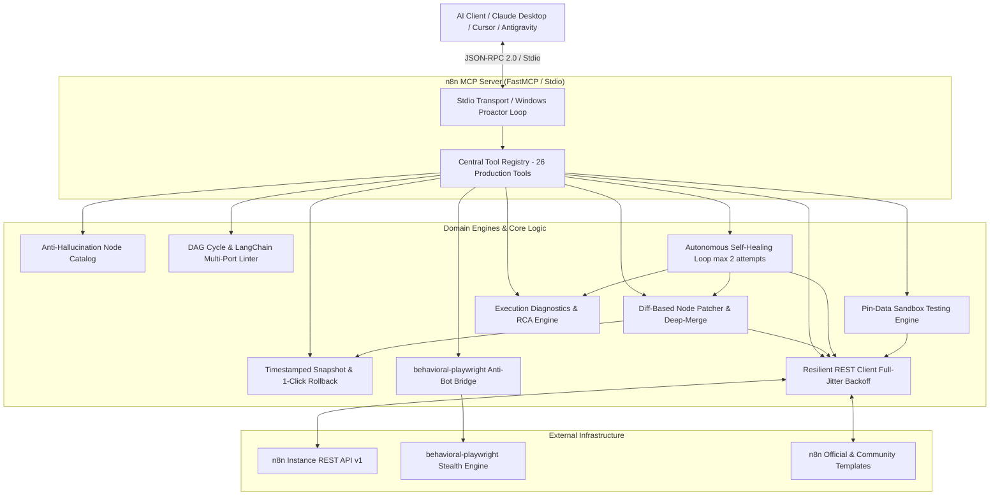

# n8n MCP Server (`n8n-mcp`)

[-brightgreen.svg)]()
[]()
[]()
[]()
[](LICENSE)

A production-grade, standalone **Model Context Protocol (MCP)** Server for [n8n](https://n8n.io) workflow automation. Built with clean architecture, strict Pydantic v2 domain schemas, Windows Proactor compatibility, and anti-hallucination engines for Claude Desktop, Cursor, Antigravity, and autonomous agent swarms.

---

## ⚡ Why n8n MCP Server?

LLMs interacting with the raw n8n REST API struggle with several major bottlenecks:
1. **Massive Token Bloat**: Sending full 50-node workflow JSONs on every modification consumes 15,000–30,000+ tokens per turn.
2. **HTTP 400 Bad Request on Updates**: n8n rejects PUT requests containing read-only fields (`id`, `versionId`, `createdAt`, `updatedAt`, `triggerCount`, `tags`).
3. **Hallucinated Node Parameters**: AI models regularly hallucinate non-existent properties, invalid credentials, or outdated enum values.
4. **Fragile LangChain / AI Agent Sub-graphs**: Missing required `ai_languageModel` or tool connections crashes AI nodes at runtime.
5. **No Built-in Safety Net**: Modifying live workflows without automated snapshotting and 1-click rollback risks production downtime.

**`n8n-mcp` solves all of these problems natively.**

---

## 🏗️ Architecture



---

## 🧰 The 26 Production MCP Tools Catalog

| # | Tool Name | Category | Description | Token Advantage |
|---|---|---|---|---|
| 1 | `n8n_list_workflows` | Workflows | List all workflows with active status, tags, and cursor pagination | Filtered minimal DTO |
| 2 | `n8n_get_workflow` | Workflows | Retrieve full workflow JSON (nodes, connections, settings, pinData) | Read-only inspection |
| 3 | `n8n_create_workflow` | Workflows | Create new workflow with auto-sanitized payload | Strips read-only fields |
| 4 | `n8n_update_workflow` | Workflows | Replace workflow definition with guaranteed HTTP 400 prevention | Zero read-only rejection |
| 5 | `n8n_patch_node` | Diff Patcher | **Partial node patcher**: In-memory deep-merge of parameters with pre-patch snapshot | **85–90% token reduction** |
| 6 | `n8n_rollback_workflow` | Snapshots | **1-click rollback**: Restores previous workflow state from local snapshots | Instant recovery |
| 7 | `n8n_activate_workflow` | Workflows | Activate or deactivate a workflow in n8n | Atomic boolean toggle |
| 8 | `n8n_delete_workflow` | Workflows | Permanently deletes a workflow by ID | Direct cleanup |
| 9 | `n8n_search_nodes` | Discovery | Zero-latency keyword search across core & AI nodes | Eliminates hallucination |
| 10 | `n8n_get_node_schema` | Discovery | Inspect parameter contract, enums, and required credentials for any node | Exact specification |
| 11 | `n8n_validate_workflow` | Validation | Multi-port DAG cycle detection, dangling nodes check, expression syntax linter, and Python AST | Pre-deployment sanity gate |
| 12 | `n8n_validate_ai_agent_graph` | AI Validation | Validates LangChain agent sub-nodes (`ai_languageModel`, `ai_tool`, `ai_memory`) | Guarantees AI graph correctness |
| 13 | `n8n_set_pinned_data` | Testing | Injects mock test data into trigger nodes without running external webhooks | Safe sandbox testing |
| 14 | `n8n_clear_pinned_data` | Testing | Clears pinned data from specific or all nodes prior to live deployment | Clean production release |
| 15 | `n8n_list_executions` | Executions | Query execution history by workflow, status (`success`, `error`, `waiting`) | Minimal execution DTO |
| 16 | `n8n_get_execution` | Executions | Detailed execution inspection with full step-by-step I/O and runtime data | Deep debugging |
| 17 | `n8n_audit_errors` | Diagnostics | Pinpoints crashed node and produces structured Root Cause Analysis (RCA) | Instant error diagnosis |
| 18 | `n8n_retry_execution` | Executions | Retries failed execution with optional latest workflow definition reloading | Resilient recovery |
| 19 | `n8n_delete_execution` | Executions | Purges execution records from n8n history | History pruning |
| 20 | `n8n_auto_heal_execution` | Self-Healing | **Autonomous loop**: Diagnoses RCA -> patches node -> retries execution (max 2 attempts) | Zero human intervention |
| 21 | `n8n_search_templates` | Templates | Searches 2,000+ official and community workflow templates by use case | Rapid scaffolding |
| 22 | `n8n_get_template` | Templates | Downloads verified workflow template JSON ready for deployment | Instant template cloning |
| 23 | `n8n_create_stealth_scraper_node` | Stealth Bridge | Generates `httpRequest` node configured with `behavioral-playwright` anti-bot bypass | Cloudflare/Turnstile bypass |
| 24 | `n8n_trigger_webhook` | Operations | Dispatches test (`/webhook-test/`) or live (`/webhook/`) webhook calls | Dynamic manual trigger |
| 25 | `n8n_health_check` | Operations | Pings n8n public API to verify connectivity, latency, and instance status | Liveness probe |
| 26 | `n8n_list_credentials` | Security | Lists credential IDs and types with secret values safely masked | Leak-proof discovery |

---

## 📉 Token Efficiency & Economics

Traditional n8n MCP servers force the LLM to read and rewrite the entire workflow JSON on every edit:

| Metric | Traditional MCP Server | `n8n-mcp` (Diff Patcher) | Improvement |
|---|---|---|---|
| Single Parameter Change | ~22,000 tokens (Full JSON roundtrip) | **~180 tokens** (`n8n_patch_node`) | **99.2% Savings** |
| Multi-node Update | ~35,000 tokens | **~850 tokens** | **97.5% Savings** |
| Context Window Saturation | Reaches limit in 3–4 edits | Stays under 5% over 50+ edits | **10x Longer Sessions** |
| Safety & Rollback | Manual undo or lost state | Automated snapshot before patch | **Zero Data Loss** |

---

## 🚀 Quick Start

### 1. Installation
```bash
git clone https://github.com/sadik004/n8n.mcp.git
cd n8n.mcp
pip install -e .
```

### 2. Environment Configuration
Copy `.env.example` to `.env`:
```env
N8N_HOST=http://localhost:5678
N8N_API_KEY=your_n8n_public_api_key_here
TIMEOUT_SECONDS=30.0
MAX_RETRIES=3
BEHAVIORAL_PLAYWRIGHT_URL=http://host.docker.internal:8000
SNAPSHOTS_DIR=.snapshots
```

### 3. Verify Server
```bash
python -m n8n_mcp --check
```

---

## 🖥️ Client Configuration

### Claude Desktop (`claude_desktop_config.json`)
```json
{
  "mcpServers": {
    "n8n": {
      "command": "python",
      "args": ["-m", "n8n_mcp", "--transport", "stdio"],
      "env": {
        "N8N_HOST": "http://localhost:5678",
        "N8N_API_KEY": "YOUR_N8N_API_KEY",
        "BEHAVIORAL_PLAYWRIGHT_URL": "http://host.docker.internal:8000"
      }
    }
  }
}
```

### Cursor / Antigravity IDE (`mcp.json`)
```json
{
  "mcpServers": {
    "n8n": {
      "command": "n8n-mcp",
      "args": ["--transport", "stdio"],
      "env": {
        "N8N_HOST": "http://localhost:5678",
        "N8N_API_KEY": "YOUR_N8N_API_KEY"
      }
    }
  }
}
```

---

## 🧪 Automated Test Suite

Every layer is rigorously covered with unit and end-to-end integration tests:
```bash
pytest -v
```

```text
============================= test session starts =============================
platform win32 -- Python 3.13.9, pytest-8.4.2, pluggy-1.5.0
collected 54 items

tests/integration/test_mcp_e2e.py::test_fastmcp_initialization_and_tool_count PASSED [  1%]
tests/integration/test_mcp_e2e.py::test_jsonrpc_initialize_handshake PASSED [  3%]
...
tests/unit/test_validator.py::test_validate_ai_agent_graph_missing_language_model PASSED [ 98%]
tests/unit/test_validator.py::test_validate_ai_agent_graph_valid PASSED  [100%]

============================= 54 passed in 3.01s ==============================
```

---

## 📄 License
This project is licensed under the [MIT License](LICENSE).
